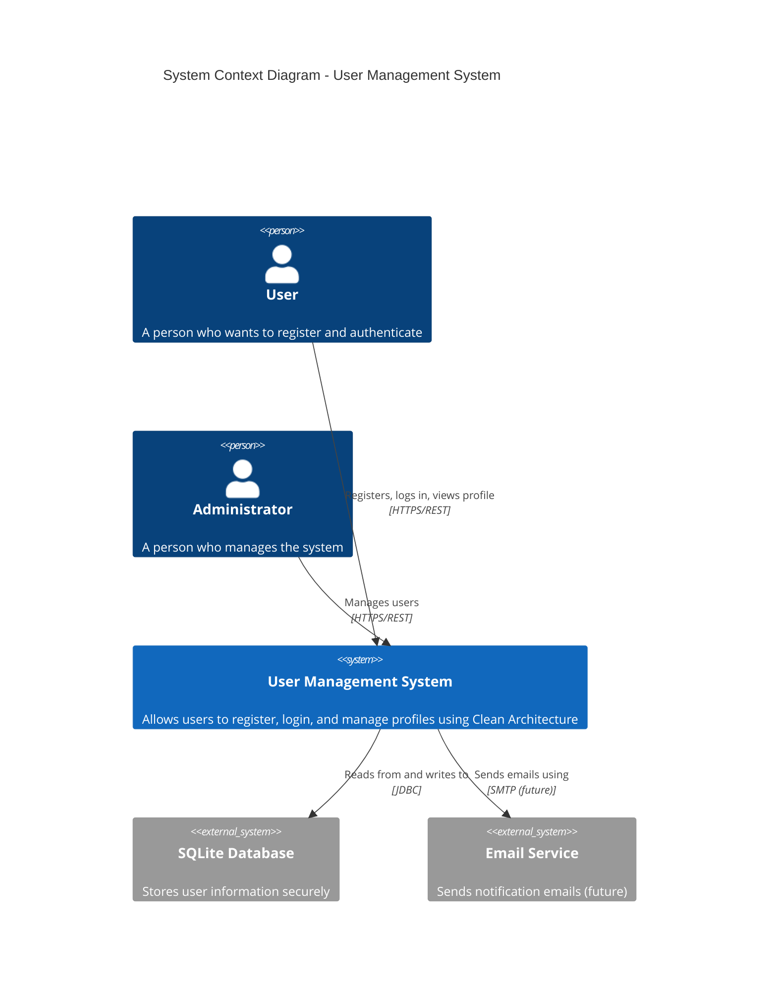
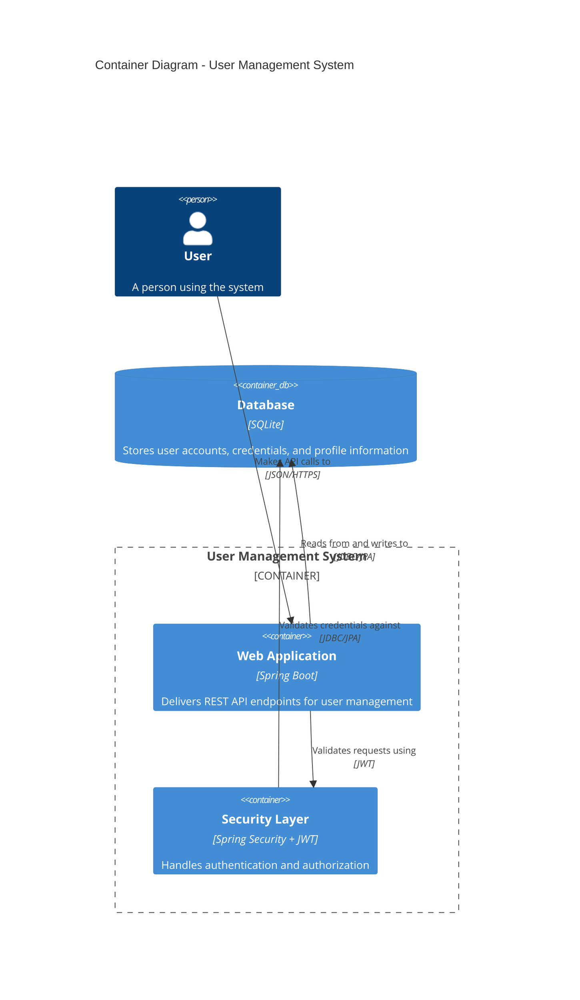
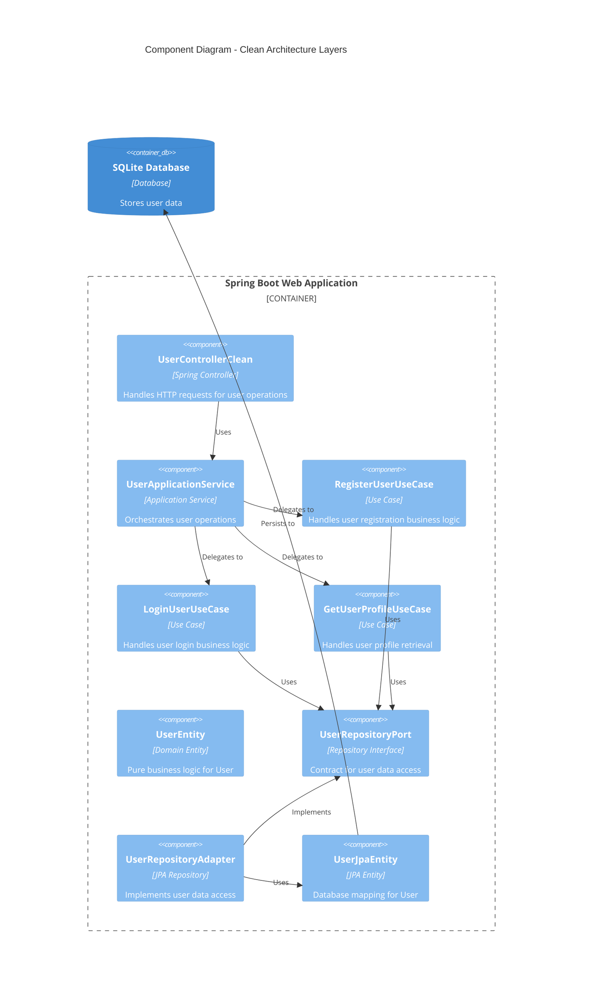
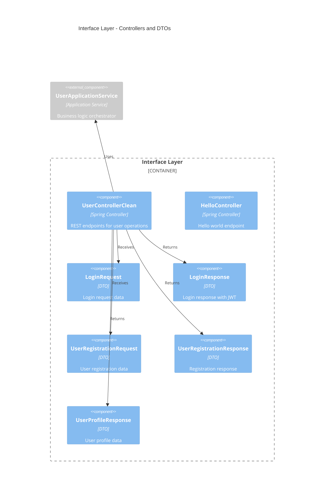
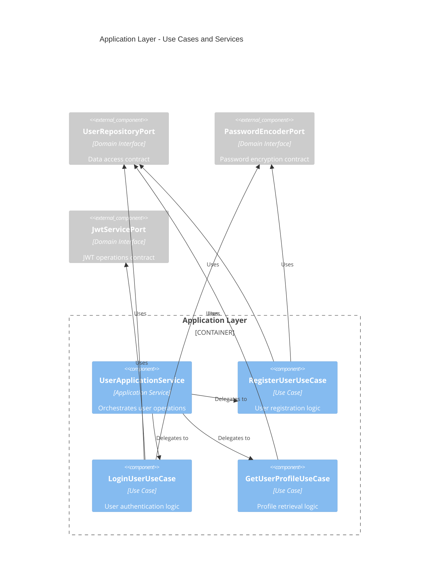
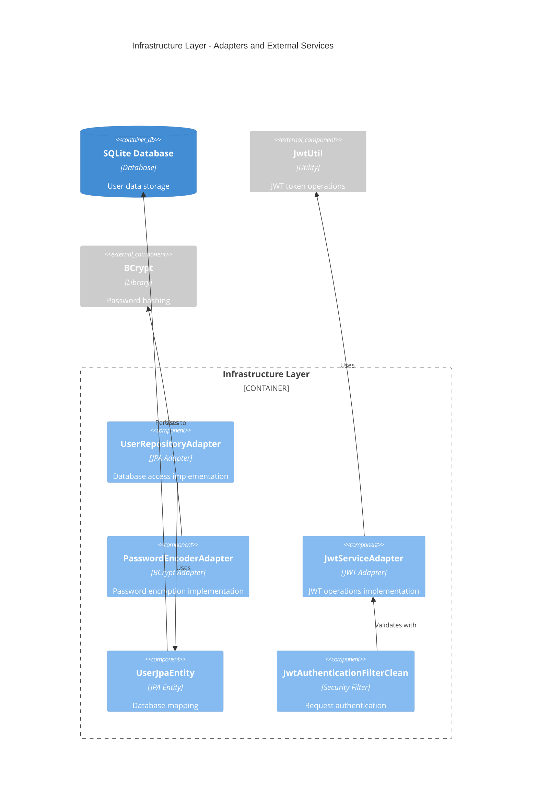
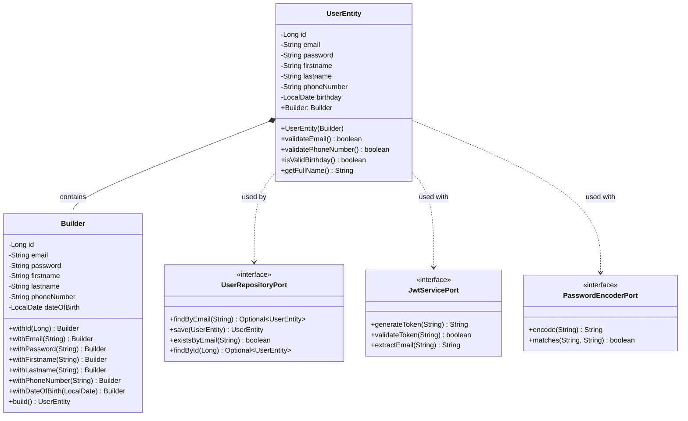
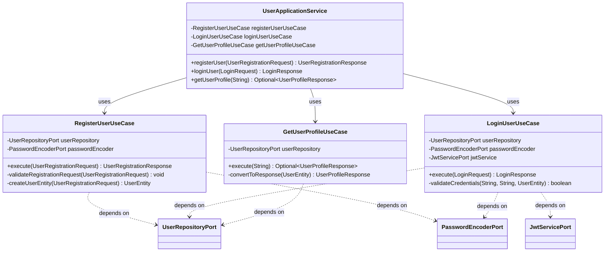
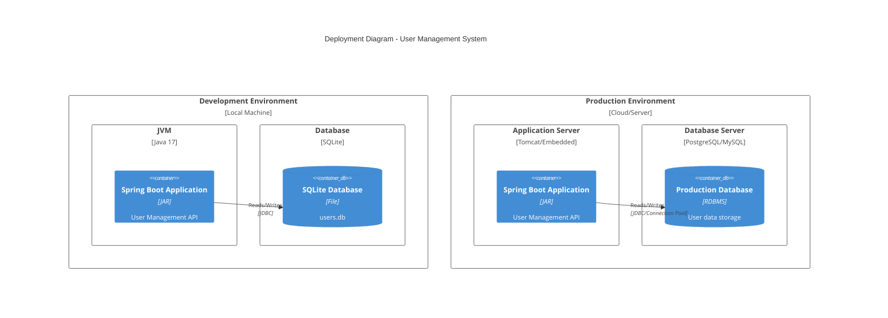
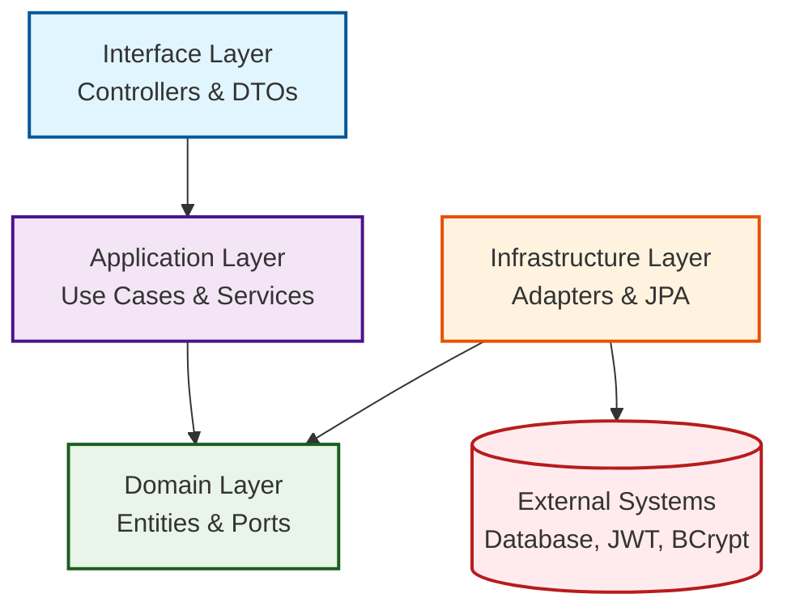

# C4 Architecture Diagrams

This document contains C4 model diagrams for the Clean Architecture Spring Boot application.

## C4 Model Overview

The C4 model consists of 4 levels:
- **Level 1**: System Context - Shows how the system fits into the world
- **Level 2**: Container - Shows the high-level technical building blocks  
- **Level 3**: Component - Shows components within a container
- **Level 4**: Code - Shows how components are implemented (class diagrams)

---

## Level 1: System Context Diagram

Shows the big picture - how users interact with the system and external dependencies.

---

## Level 2: Container Diagram  

Shows the high-level technical building blocks and how they interact.

---

## Level 3: Component Diagram

Shows the internal components following Clean Architecture principles.

---

## Level 3a: Interface Layer Components

---

## Level 3b: Application Layer Components

---

## Level 3c: Infrastructure Layer Components

Shows the key classes and their relationships in the Domain layer.

---

## Level 4: Code Diagram - Application Layer

Shows the Use Cases and Application Service structure.

---

## Level 4: Deployment Diagram

Shows how the system is deployed in different environments.

---

## Clean Architecture Layer Dependencies

---

## Key Architectural Patterns

### Dependency Inversion
- High-level modules (Use Cases) don't depend on low-level modules (Infrastructure)
- Both depend on abstractions (Ports/Interfaces)
- Infrastructure layer implements the interfaces defined in Domain layer

### Separation of Concerns
- **Interface Layer**: HTTP concerns, data transformation
- **Application Layer**: Use case orchestration, business workflows  
- **Domain Layer**: Business rules, entities, contracts
- **Infrastructure Layer**: External services, databases, frameworks

### Benefits
- **Testability**: Each layer can be tested in isolation
- **Flexibility**: Easy to change infrastructure without affecting business logic
- **Maintainability**: Clear boundaries and responsibilities
- **Independence**: Domain logic is framework-agnostic

---

*These C4 diagrams provide a comprehensive view of the system architecture following Clean Architecture principles.*
