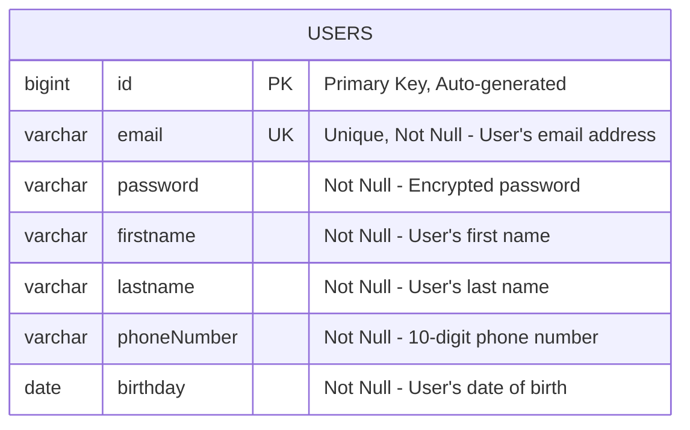

# Database Schema Documentation

This document contains the Entity-Relationship Diagram (ER Diagram) for the Clean Architecture project database schema.

## Database Design Overview

The database schema follows the Clean Architecture pattern with:
- **Domain Layer**: Pure business entities (`UserEntity`)
- **Infrastructure Layer**: JPA entities for database persistence (`UserJpaEntity`)
- Clear separation between business logic and persistence concerns

## Entity-Relationship Diagram



## Table Details

### USERS Table

| Column | Type | Constraints | Description |
|--------|------|-------------|-------------|
| `id` | `BIGINT` | PRIMARY KEY, AUTO_INCREMENT | Unique identifier for each user |
| `email` | `VARCHAR(255)` | UNIQUE, NOT NULL | User's email address (used for login) |
| `password` | `VARCHAR(255)` | NOT NULL | Encrypted password using BCrypt |
| `firstname` | `VARCHAR(255)` | NOT NULL | User's first name |
| `lastname` | `VARCHAR(255)` | NOT NULL | User's last name |
| `phoneNumber` | `VARCHAR(255)` | NOT NULL | User's phone number (10 digits) |
| `birthday` | `DATE` | NOT NULL | User's date of birth |

## Validation Rules

### Email
- Must be a valid email format
- Must be unique across all users
- Required field

### Password
- Minimum length requirements enforced at application level
- Encrypted using BCrypt before storage
- Required field

### Phone Number
- Must be exactly 10 digits
- Pattern: `^[0-9]{10}$`
- Required field

### Birthday
- Must be a past date (not future)
- Format: `yyyy-MM-dd`
- Required field

### Names (firstname, lastname)
- Cannot be blank or empty
- Required fields

## Database Technology

- **Database**: SQLite (for development/testing)
- **ORM**: JPA/Hibernate
- **Connection Pool**: HikariCP (Spring Boot default)

## Architecture Mapping

### Clean Architecture Layers

1. **Domain Layer** (`UserEntity`)
   - Pure business entity
   - No JPA annotations
   - Contains business validation logic
   - Independent of frameworks

2. **Infrastructure Layer** (`UserJpaEntity`)
   - JPA/Database mapping entity
   - Contains persistence annotations
   - Converts to/from domain entities
   - Database-specific concerns only

### Entity Conversion

The system uses a clear conversion pattern:
```java
// JPA Entity -> Domain Entity
UserEntity domainUser = jpaEntity.toDomainEntity();

// Domain Entity -> JPA Entity
UserJpaEntity jpaEntity = new UserJpaEntity(domainUser);
```

## Future Considerations

### Potential Schema Extensions
- User roles/permissions table
- User sessions/tokens table
- User profile images/documents
- Audit logging table
- User preferences table

### Scalability Considerations
- Indexing on frequently queried fields (email)
- Partitioning strategies for large user bases
- Read replicas for query performance
- Connection pooling optimization

## Security Considerations

- Passwords are never stored in plain text
- Email uniqueness prevents duplicate accounts
- Date validation prevents invalid birthdates
- Phone number format validation ensures data consistency

---

*This documentation is generated based on the Clean Architecture implementation of the user management system.*
